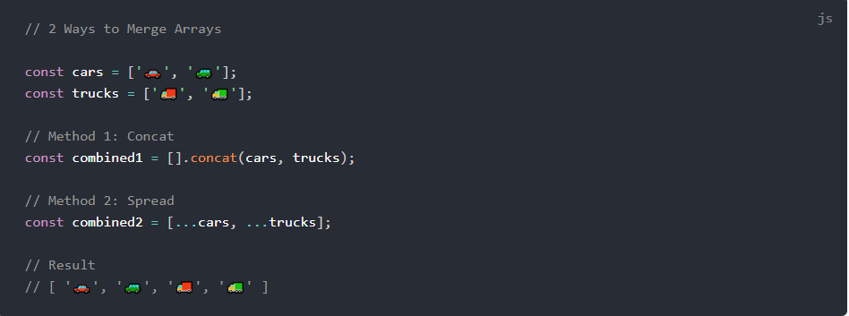

# Passing Functions as Props

## lists and keys

### What does .map() return?

A new array with each element being the result of the callback function.

### If I want to loop through an array and display each value in JSX, how do I do that in React?

* forloop
* forEach
* map

### Each list item needs a unique ____

Each list item needs a unique key

### What is the purpose of a key?

Keys are used to React to identify which items in the list are changed, updated, or deleted. In other words, we can say that keys are used to give an identity to the elements in the lists

-----------

## The Spread Operator

### What is the spread operator?

Spread operator allows an iterable to expand in places where 0+ arguments are expected. It is mostly used in the variable array where there is more than 1 values are expected. It allows us the privilege to obtain a list of parameters from an array.

### List 4 things that the spread operator can do

* Copying an array.
* Concatenating or combining arrays.
* Using Math functions.
* Using an array as arguments.

### Give an example of using the spread operator to combine two arrays

-----

### Give an example of using the spread operator to add a new item to an array

------------
### Give an example of using the spread operator to combine two objects into one

----------
